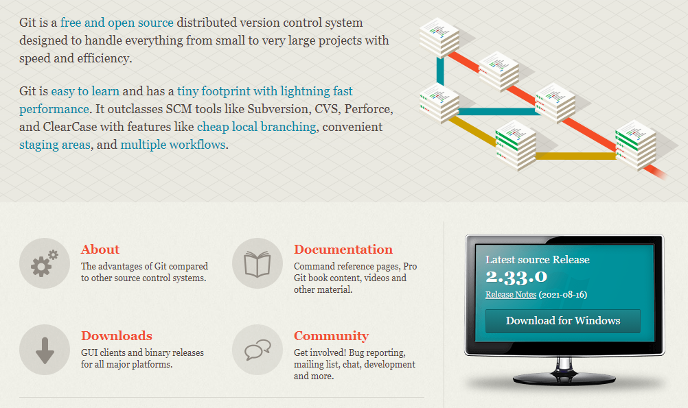
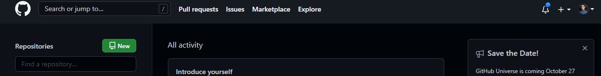
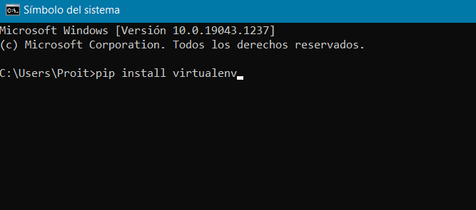
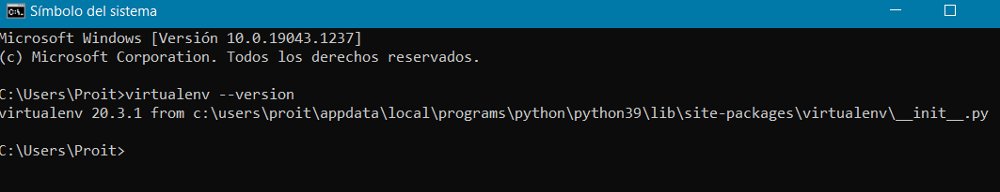
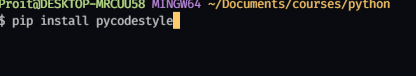
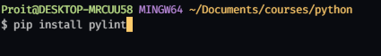
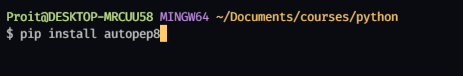
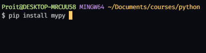

[<< Inicio](./intro.md) [< Volver](./how_start.md) || [FIN](./intro.md)

---

## Versionamiento de proyectos

[GIT](https://git-scm.com/)

- Descargar e instalar

## Repositorios remotos

1. Ingrese a [Github](https://github.com/)
2. Registrarse
3. Listo a crear proyectos

## Entornos virtuales de un proyecto

1. Instalar via pip [VirtualEnv](https://virtualenv.pypa.io/en/latest/)

2. Revisar su instalación

## Estilo de código

1. Instalar [Pycodestyle](https://pypi.org/project/pycodestyle/) via pip

2. Instalar [Pylint](https://pylint.org/) via pip

3. Instalar [Autopep8](https://pypi.org/project/autopep8/) via pip

## Tipado estático (Opcional)

1. Instalar [Mypy](https://mypy.readthedocs.io/en/stable/) via pip

---

[<< Inicio](./intro.md) [< Volver](./how_start.md) || [FIN](./intro.md)
