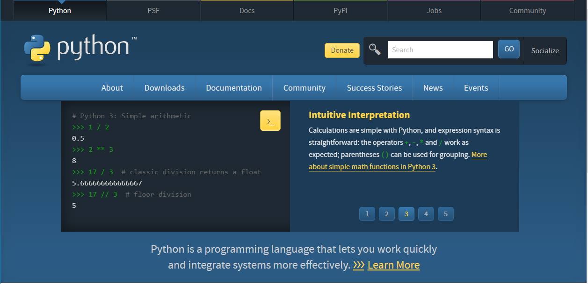
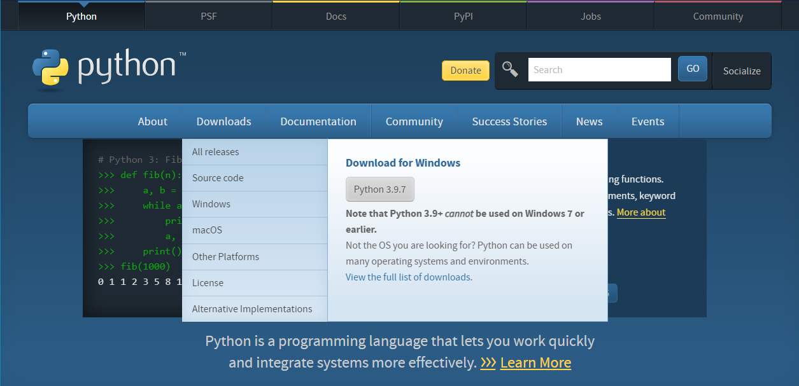
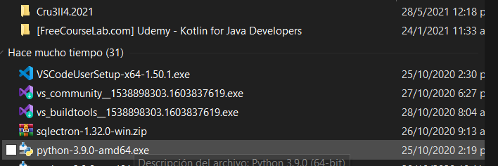
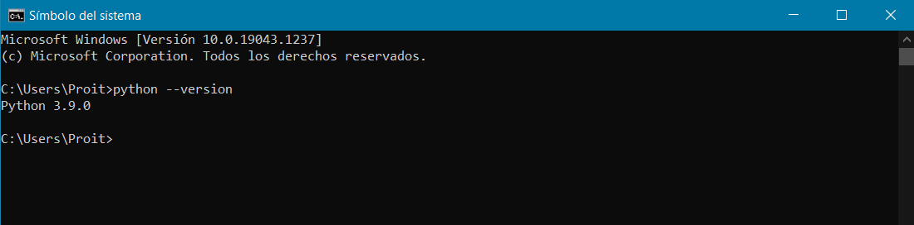
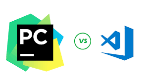
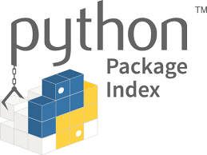
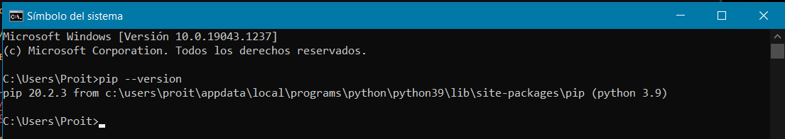
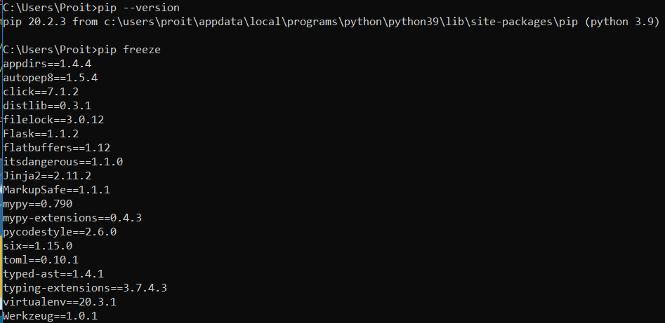

[<< Inicio](./README.md) [< Volver](./why_python.md) || [Siguiente >](./how_grow.md)

---

## Instalación Python compilador

1. Ingresar a [https://www.python.org/](https://www.python.org/)

2. Descargar version de python actual

3. Iniciar instalador

4. Comprobar instalación, desde el terminal(Linux o Mac) o cmd (WIN)

## ¿ Que es un editor de código ?, ¿ Qué es un IDE ?

## Instalación del Editor de código

| Editor de codigo                          | IDE                                             |
| ----------------------------------------- | ----------------------------------------------- |
| [VsCode ](https://code.visualstudio.com/) | [Intelij IDEA](https://www.jetbrains.com/idea/) |
| [Atom](https://atom.io/)                  | [Pycharm](https://www.jetbrains.com/pycharm/)   |

## Revisión del gestor de paquetes de python (PIP)

---

[<< Inicio](./README.md) [< Volver](./why_python.md) || [Siguiente >](./how_grow.md)
