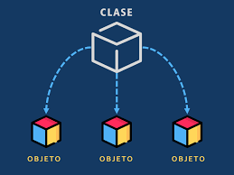
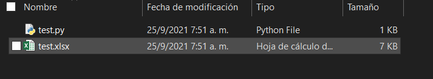

[< Volver](./README.md) || [Siguiente >](./how_start.md)

---

## ¿ Qué es Python ?

Python es un lenguaje de programación **multi-proposito**:

Python es un lenguaje de programación **multi-paradigma**:

Python es un lenguaje de programación **multi-plataforma**:

Python es un lenguaje de programación **de código abierto**:

Python es un lenguaje de programación **interpretado** y **dinámico**:

## ¿ Por qué Python ?

- [RedMonk Rank](https://redmonk.com/sogrady/2021/08/05/language-rankings-6-21/)

- [Tiobe Rank](https://www.tiobe.com/tiobe-index/)

- [Github Rank](https://madnight.github.io/githut/#/pull_requests/2021/2)

- [Extensa documentación, https://www.python.org/doc/](https://www.python.org/doc/)
- Multiples librerias destinadas al análisis de datos
- Facilidad de aprendizaje

## ¿ Y Excel ?

---

[< Volver](./README.md) || [Siguiente >](./how_start.md)
