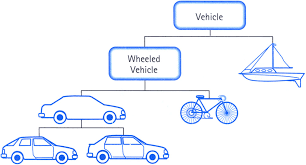
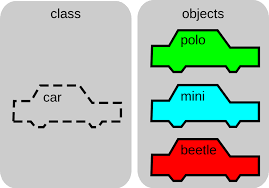

[<< Inicio](./README.md) [< Volver](./README.md) || [Siguiente >](./methods.md)

---

## Clases



## Objetos o instancia



## Propiedades o atributos

```python
class Car():
  def __init__(self, model, mark, doors):
    self.model = model
    self.mark = mark
    self.doors = doors

```

## Accesibilidad

```python
# Propiedades públicas
class Car():
  def __init__(self, model, mark, doors):
    self.model = model
    self.mark = mark
    self.doors = doors

car = Car("deportivo", "Toyota", 3)
print(car.model)
car.model = "camioneta"
# No hay propiedades privadas, sin embargo por convención
class Car():
  def __init__(self, model, mark, doors):
    self.__model__ = model
    self.__mark__ = mark
    self.__doors__ = doors

car = Car("deportivo", "Toyota", 3)
# Todavia se tiene acceso
print(car.__model__)
car.model = "camioneta"
```

---

[<< Inicio](./README.md) [< Volver](./README.md) || [Siguiente >](./methods.md)
