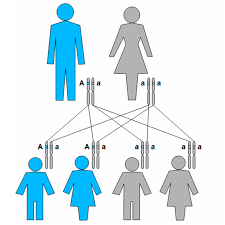

[<< Inicio](./README.md) [< Volver](./methods.md) || [Siguiente >](./oop.md)

---

## Herencia



```python
class Dad(Person):
  def __init__(self, name):
      super().__init__(name)


class Mom(Person):
  def __init__(self, name):
      super().__init__(name)


person = Person("Jose")
dad = Dad("Manuel")
mom = Mom("Maria")

print(person.name, dad.name, mom.name)
```

## Acceso al super constructor

```python
class Dad(Person):
  def __init__(self, name):
      # Constructor del ancestro
      super().__init__(name)


class Mom(Person):
  def __init__(self, name):
      Person.__init__(self,name)


person = Person("Jose")
dad = Dad("Manuel")
mom = Mom("Maria")

print(person.name, dad.name, mom.name)
```

## Acceso a metodos heredados

```python
class Pet():
    def __init__(self, name):
        self.name = name
        self.__hungry__ = True
        self.__falling_asleep__ = False
        self.__boring__ = True
        self.__mood__ = "angry"

    def eat(self):
        self.__hungry__ = False
        self.__falling_asleep__ = True

    def sleep(self):
        self.__falling_asleep__ = False
        self.__boring__ = True

    def play(self):
        self.__boring__ = False
        self.__hungry__ = True

    def mood(self):
        if (self.__hungry__ or self.__boring__):
            return "enojado"
        else:
            return "feliz"
class Dog(Pet):
  def __init__(self, name):
    super().__init__(name)
  def bark(self):
    print("Wof wof!")

dog = Dog("Bethoven")
print("El perro esta: ", dog.mood())
dog.eat()
print("El perro esta: ", dog.mood())
dog.sleep()
print("El perro esta: ", dog.mood())
dog.play()
print("El perro esta: ", dog.mood())
dog.eat()
print("El perro esta: ", dog.mood())
dog.bark()
dog.bark()

# output:
# El perro esta:  enojado
# El perro esta:  enojado
# El perro esta:  enojado
# El perro esta:  enojado
# El perro esta:  feliz
# Wof wof!
# Wof wof!
```

## Multi herencia

```python
class Person():
    def __init__(self, name, last_name):
        self.name = name
        self.last_name = last_name

    def say_hello(self):
        return f"Hi, my name is {self.name} {self.last_name}"


class Serializable():
    def __init__(self, id):
        self.__id__ = id


class PersonWithAge(Person, Serializable):
    def __init__(self, name, last_name, age, id):
        Person.__init__(self, name, last_name)
        Serializable.__init__(self, id)
        self.age = age

    def say_hello(self):
        return Person.say_hello(
            self) + f". My age is {self.age}. And my id is {self.__id__}"


person = Person("Cruz", "Ortiz")
personWithAge = PersonWithAge("German", "Montero", 29, 85)

print(person.say_hello(), personWithAge.say_hello())
```

---

[<< Inicio](./README.md) [< Volver](./methods.md) || [Siguiente >](./oop.md)
